# 임베디드 README


### 설치 및 기본 세팅

#### 설치 + 키보드 세팅 - ibus

- https://kwonkyo.tistory.com/398 참고하여 진행 (설치)

```bash
# 한글 키보드 설치 코드
pi@raspberrypi :~ $ sudo apt-get install ibus
pi@raspberrypi :~ $ sudo apt-get install ibus-hangul
pi@raspberrypi :~ $ sudo apt-get install fonts-unfonts-core
```

- 설치가 완료되면 "시작 > Preferences > IBus Prefrences" 메뉴를 통해 IBus설정창을 열어줍니다.

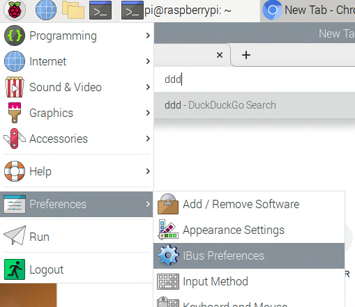


- 처음에 IBus가 실행되고 있지 않다면 실행하겠냐는 확인창이 뜨고 다음으로 다음과 같이 실행에 문제가 있을 때 취할 수 있는 조치사항을 보여주는 창이 나타납니다. 제 경우 별 문제없었기 때문에 그냥 무시합니다.

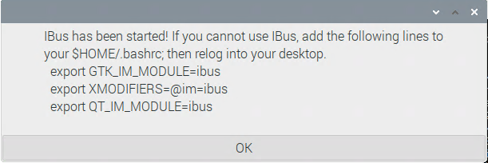


- 설정창에서 Input 탭을 열어보면 영어만 보이는데요 여기에 한글 입력기를 추가해 줍니다.

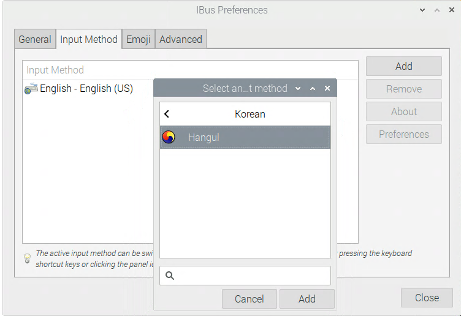


- 그리고 작업표시줄에 있는 'EN'이라고 되어 있는 입력기 선택 아이콘을 눌러서 태극무늬 아이콘으로 변경해주면 이제부터 한/영을 오가며 입력을 할 수 있게 됩니다. 한영키뿐만 아니라 맥에서 사용하는 조합인 Ctrl+Space도 한/영 전환으로 인식하네요.

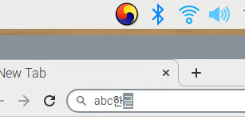


#### 키보드 세팅 - fcitx

- https://bebutae.tistory.com/190

```bash
$ sudo apt-get install fcitx -y
$ sudo apt-get install fcitx-hangul -y
$ sudo nano /etc/default/im-config
```

- IM_CONFIG_DEFAULT_MODE=auto를 IM_CONFIG_DEFAULT_MODE=fcitx로 수정해줍니다.

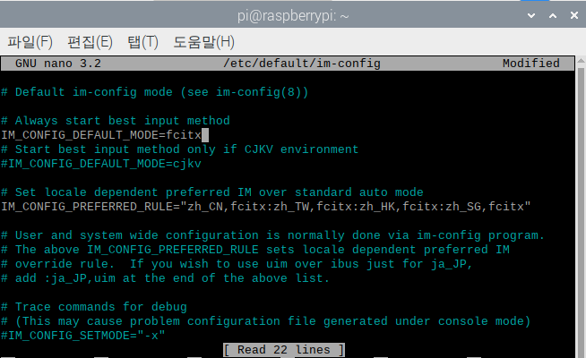

- Ctrl+x, y, enter를 순서대로 눌러 설정을 저장하고 종료해줍니다. 이제 설치와 기본 셋팅이 끝났습니다.

- 아래 사진과 같이 메뉴를 열고 기본설정의 입력기를 눌러주세요.

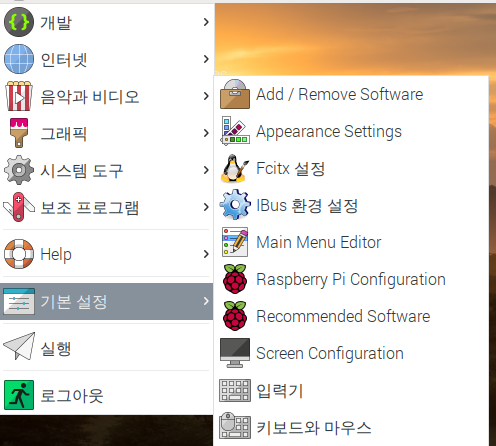

- 확인을 누르시고, 예를 눌러 설정을 업데이트하러 이동하겠습니다.

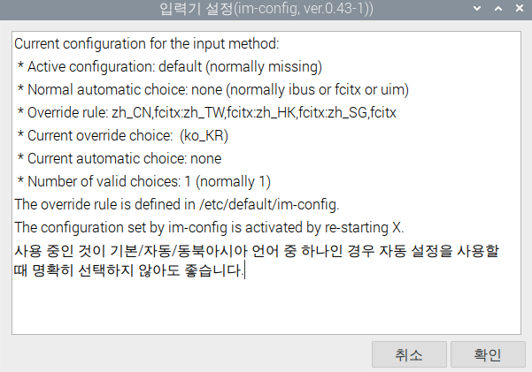

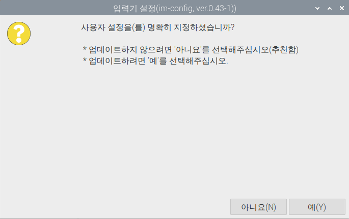

- 최상단의 default를 체크하시고 확인을 눌러주세요.

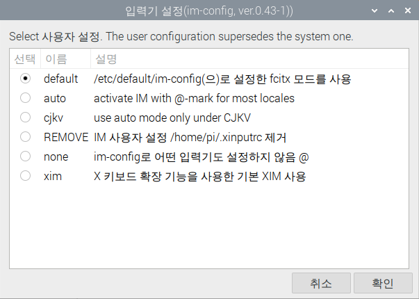

- 한번 더 확인을 눌러주세요.

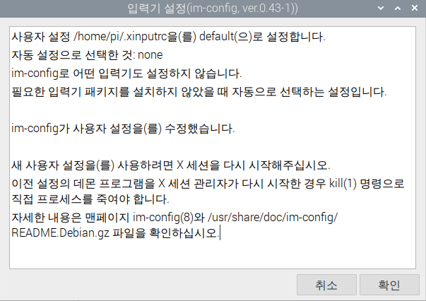


### 초음파 세팅

- https://blog.naver.com/dokkosam/222156002480
- https://m.blog.naver.com/roboholic84/220319850312

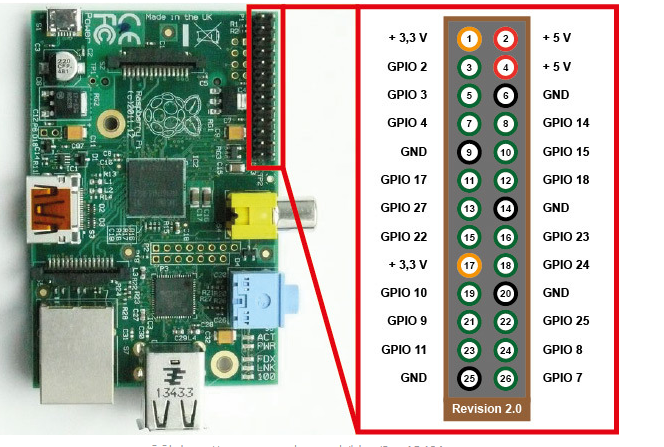

- 우리가 사용한 코드는 ultrasound Test.py 에 들어있음


### PyQt5 + pyWebview + GTK

```bash
pi@raspberrypi:~ $ sudo apt-get install python3-pyqt5
pi@raspberrypi:~ $ pip3 install pywebview-3.5-py3-none-any.whl # 다운로드 받은 pywebview 파일명
pi@raspberrypi:~ $ sudo apt-get install python3-pyqt5.qtwebkit # pywebview는 창을 띄우는 엔진으로 qtwebkit or qtwebengine을 필요로함. qtwebengine은 현재 라즈베리파이 버전에선 지원이 안됨
```

- python3-pyqt5를 설치 (pip3 install pyqt5는 먹히지 않았음)
- https://www.piwheels.org/simple/pywebview/ 에서 최신버전 pywebview 다운로드
- https://chmodi.tistory.com/114 를 참고하여 whl 파일 설치
- 설치하고 나서 실행해보니 실행 엔진이 없어서 python3-pyqt5.qtwebkit 설치
- 추후에 qtwebkit은 버전 업데이트가 안된 오래된 엔진이라 로컬저장소를 지원하지 못해 최신 버전의 엔진이 필요해짐
  - qtwebengine은 라즈베리파이4와 같은 arm 프로세서를 지원하지 않기 때문에 개별적으로 컴파일을 진행해야했지만, 어려워서 사용하지 못했음.
  - 대안으로 GTK webkit2 엔진을 사용해서 진행
  - [Installation | pywebview (flowrl.com)](https://pywebview.flowrl.com/guide/installation.html) 에서 Linux 탭의 PyGObject에 기반한 GTK 설치

```sh
$ sudo apt install python3-gi python3-gi-cairo gir1.2-gtk-3.0 gir1.2-webkit2-4.0
```


### OpenCV

- https://webnautes.tistory.com/916 를 참고하여 설치하였음 (cmake build)


### 더미 바코드 생성

- [바코드 생성](barcode/바코드 생성 프로그램 - 병진.md) 문서를 참고하여 바코드 생성
- 필요시 카메라를 통해 스캔하여 활용


### 작업 내역 기록

- 210723 작업내역
  - 라즈베리파이 os 설치
  - 한글 설치
  - 초음파 모듈 테스트


- 210803 작업 내역 

  - 오전 

    - pywebview 3.5 버전으로 업데이트 https://chmodi.tistory.com/114 참고함
    - ubuntu 21.04 버전 설치 했었음

  - 오후

    - 면담 결과 다시 라즈베리파이 os로 롤백
    - pywebview 를 통해 간단한 이벤트 처리 성공
    - 기존 코드와 합쳐서 테스트에도 일단 성공
    - 재설치 후에 진행된 라즈베리파이 os에서도 무사히 진행됨
    - 지금까지 진행된 내역 문서화 작업


- 210804 작업 내역
  - 오전
    - 교수님과 오전 스크럼
    - 재민 - ms azure 얼굴 인식
    - 병진 - aws 얼굴 인식
  - 오후
    - 팀원들과 회의를 통해 naver clova 로 얼굴 인식 시스템 결정
    - 바코드 스캐너 생성, 인식 방법 탐색
    - opencv 재설치(병진)


- 210805 작업 내역
  - 오전
    - 오전 스크럼
    - product_id 변경 관련 + crud 도입 여부 회의
    - 병진 - 바코드 생성 방법 찾기
    - 재민 - 바코드 인식 방법 찾기
  - 오후
    - 병진 - 바코드 생성 코드 구현
    - 재민 - 바코드 인식 코드 구현
    - 생성된 코드를 기반으로 인식 테스트 - 통과 (EAN13을 사용하기로 정함)
    - 웹 + 바코드 + 얼굴인식 모두 통합하는 코드 개발중
    - 내일 발표를 위한 영상 자료 만드는 중 (광고 유튜브 + 메인 페이지)


- 210806 작업 내역
  - 오전
    - 오전 스크럼
    - 1시 발표를 위한 자료 정리 및 코드 정리 + 영상 편집
    - 발표 연습 (2~3회)
  - 오후
    - 발표하기 (3번째)
    - 팀원 평가
    - 발표 후 웹에서 바코드 페이지 인식해서 카메라를 키는 방법에 대해 논의


- 210809 작업 내역
  - 오전
    - 교수님과 미팅 + 팀원 스크림 1시간
    - 지라 작성 논의 (sub3 2주차)
    - 디자인 변경 관련 논의 + 추천 알고리즘 관련 논의
  - 오후
    - 디자인 관련해서는 교수님이 그냥 진행하라고 하셔서 디자인 일정을 삭제
    - 교수님과 최적화 등 관련문제 면담
      - 최적화 - 원래 어느정도 버벅거리는건 당연한거고, 영상부분은 라즈베리파이에 맞는 코덱, 확장자, 비율을 맞춰서 영상을 재편집하면 나아질 것 같다고 하심
      - 바코드 페이지에 카메라 키기 - 바코드 스테이터스 파일을 생성하여 이벤트를 처리하거나, 파일 내에 status = 1 과같이 특정 값을 변경시켜 이벤트 처리하도록 하는게 가장 무난하다고 하심
      - 웹페이지에 사용자 정보 넘기기 - main vue에 /:age/:gender 로 데이터를 넘긴후, vuex에 저장했다가 adclient 페이지로 넘어갈 시 삭제하도록 하기(이건 우리가 정했음)
    - 재민 - 바코드 페이지 카메라 키기 - js로 파일 생성하는 법 찾는 중
    - 병진 - 웹페이지에 사용자 정보 넘기기 - vue 다이나믹 라우팅으로 진행 중 (거의 된 거 같음)


- 210810 작업 내역
  - 오전
    - 라이브 강의 + 미팅 1시간
    - 바코드 파일 생성, 제거 찾기 - 
      - js 다운로드 기능을 통해 하려고 했으나 pywebview에서는 아직 다운로드 기능을 제대로 지원하지 못함
      - 다음으로 js를 통해 텍스트 파일을 읽어서 수정 후 저장으로 진행하려고 했으나 js 상에서 파일 쓰기는 안된다고 해서 장고는 python이고 서버이므로 axios 요청을 통해 해결하기로 함
  - 오후
    - 장고를 통해 url, view 생성
      - 문제점 - 현재 barcode.txt를 생성하는 위치가 python manage.py를 실행하는 위치에 따라서 오류가 발생할 여지를 가지고 있음 (server/embedded/status/barcode.txt vs embedded/status/barcode.txt)
      - 현재로써는 git로컬폴더/server에서 python manage.py runserver를 하는 것을 권장함..
    - vue에 해당 장고 url로 axios 연결 및 테스트 - 성공적 (파일 생성이 잘 됨)
    - 원래 사용하던 임베디드 코드에 파일이 있으면 barcode_scan 함수를 실행 후 해당 파일을 삭제하도록 함(1번만 실행되도록) 
    - 총 테스트 결과 느리지만 정상적으로 원하는 로직이 구현 완료됨
