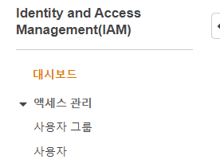
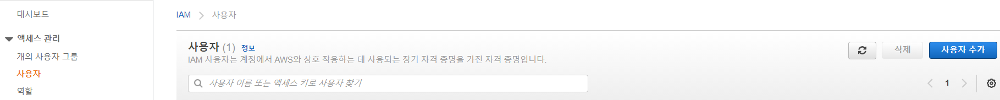
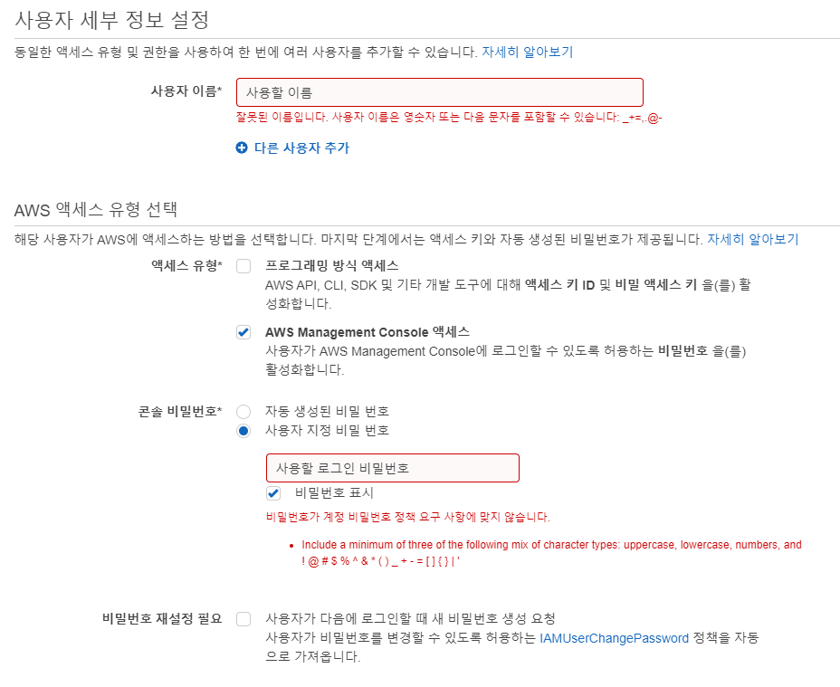
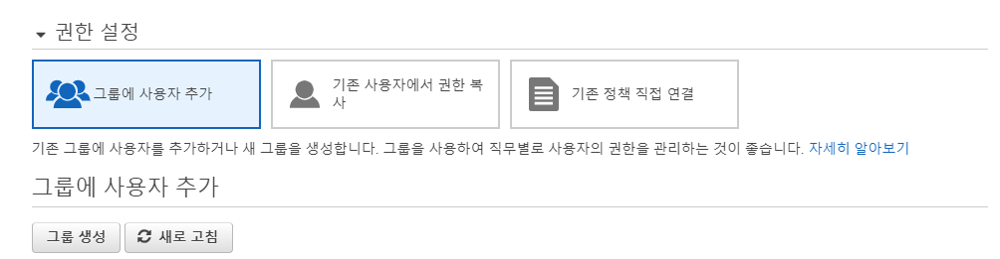
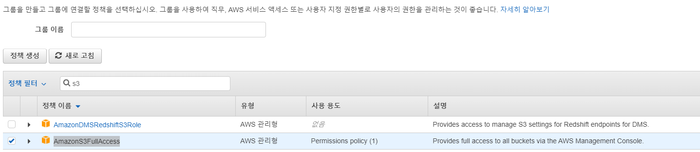
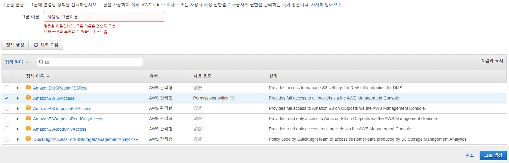

# [Amazon Rekognition](https://us-west-2.console.aws.amazon.com/rekognition/home?region=us-west-2#/) 을 이용한 얼굴 분석 - 병진


- https://docs.aws.amazon.com/rekognition/latest/dg/setting-up.html 을 기반으로 해서 진행하였음


## 1단계: AWS 계정 설정 및 IAM 사용자 생성

- Amazon Rekognition은 프리티어에선 월 2000장 까지 무료로 사용할 수 있습니다.

- AWS의 회원이 아닐 경우 회원 가입합니다. https://portal.aws.amazon.com/billing/signup

  

#### IAM 사용자가 없다면 IAM 사용자를 생성해야함. - 생성법

- https://docs.aws.amazon.com/IAM/latest/UserGuide/getting-started_create-admin-group.html 참고

- https://console.aws.amazon.com/iam/home#/home 에서 사용자 클릭



- 사용자에서 사용자 추가 버튼 클릭



- 사용자 세부 설정에서 사진을 참고하며 작성합니다.



- 권한 설정 부분에서 그룹에 사용자 추가 버튼을 누른 상태에서 그룹 생성 버튼을 누르기



- 정책 필터에서 AdministratorAccess, AmazonRekognitionFullAccess, AmazonS3FullAccess 3개에 체크
  - 관리자 접근 권한, 이미지 처리 전체 권한, s3 버킷 관련 전체 권한을 부여한다는 의미



- 그룹 이름을 적고 그룹생성 버튼 누르기



- 마지막 검토 부분에서 이상있나 체크한뒤 생성 버튼 누르기
- 완료 페이지에서 로그인 정보가 포함된 .csv을 다운로드 받거나 email을 보내도록해서 확인하도록 하기


## 2단계: AWS CLI 및 AWS SDK 설정

#### AWS SDK - python version 설치하기

- https://aws.amazon.com/ko/sdk-for-python/

```bash
$ pip install boto3
```


#### IAM 사용자 인증

- https://docs.aws.amazon.com/rekognition/latest/dg/setup-awscli-sdk.html

- 로컬에서 IAM 사용자로 인증하기 위한 액세스 키를 생성하기

  - AWS Management 콘솔에 로그인하고 https://console.aws.amazon.com/iam/ 에서 IAM 콘솔을 엽니다.
  - 탐색 창에서 **사용자를** 선택합니다.
  - [IAM 사용자](https://docs.aws.amazon.com/rekognition/latest/dg/setting-up.html#setting-up-iam) 생성 에서 [생성한](https://docs.aws.amazon.com/rekognition/latest/dg/setting-up.html#setting-up-iam) 사용자의 이름을 선택합니다 .
  - **보안 자격 증명** 탭을 선택합니다 .
  - **액세스 키 생성을** 선택합니다 . 그런 다음 **.csv 파일 다운로드를** 선택 하여 액세스 키 ID와 보안 액세스 키를 컴퓨터의 CSV 파일에 저장합니다. 파일을 안전한 위치에 저장하십시오. 이 대화 상자가 닫힌 후에는 비밀 액세스 키에 다시 액세스할 수 없습니다. CSV 파일을 다운로드한 후 **닫기를** 선택 **합니다** .

- 컴퓨터에서 홈 디렉터리로 이동하여 디렉터리를 만듭니다 `.aws`. Linux 또는 macOS와 같은 Unix 기반 시스템에서는 다음 위치에 있습니다.

  ```
  ~/.aws
  ```

- Windows에서는 다음 위치에 있습니다.

  ```
  %HOMEPATH%\.aws
  ```

- `.aws`디렉토리 에서 `credentials`라는 새 파일을 만듭니다 .

- 2단계에서 생성한 자격 증명 CSV 파일을 열고 해당 내용을 `credentials`다음 형식을 사용하여 파일에 복사 합니다.

  ```
  [default]
  aws_access_key_id = your_access_key_id
  aws_secret_access_key = your_secret_access_key
  ```

- `Credentials`파일을 저장하고 CSV 파일을 삭제합니다.
- `.aws`디렉토리에서 `config`라는 새 파일을 만듭니다.
- `config`파일을 열고 다음 형식으로 지역을 입력합니다.

```
[default]
region = your_aws_region
```

- *your_aws_region* 을 원하는 AWS 리전(예: `us-west-2`)으로 *대체* 합니다.
- `config`파일을 저장 합니다.


### 3단계

- 현재 주어진 210804_aws_test.py 를 실행
- aws_result 폴더에 01번 사진부터 25번 사진까지 응답받은 결과를 json파일로 저장
- 값을 확인 가능