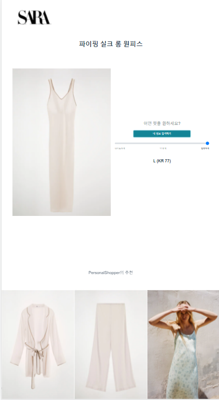

## 1. gitlab 소스 클론 이후 빌드 및 배포할 수 있는 작업 문서

- 기본 운영 체제 - Windows 10
- 기본 IDE - vscode

- 프론트엔드
  - Vue2.x
  - Vuex, Vue router

- 백엔드

  - Python 3.8.7
  - Django 3.2.5
  - 이외에는 server/requirements.txt 참고

- 임베디드

  - 사용 장치 - raspberrypi4

  - 사용 OS - raspberrypi debian buster(10)
  - 영상처리 - OpenCV 4.5.1
  - 사용 언어 - Python 3.7.0
  - 사용 라이브러리 - [임베디드 README](../embedded/README.md) 를 참고


* embedded 장치를 사용하여 키오스크 형태로 띄워주기 때문에 local 기반으로 서버를 사용하게 됨, 그래서 별도의 배포 서버는 존재하지 않으며 지급 받은 AWS 서버는 프로젝트 소개 페이지로 대체 


## 2. 프로젝트에서 사용하는 외부 서비스 정보 문서 

* Naver Clova 얼굴 인식
  * [Clova Face Recognition API 가이드 - CLOVA A.I. APIs Document (naver.com)](https://developers.naver.com/docs/clova/api/CFR/API_Guide.md)
* kakaopay 결제 시스템
  * [단건 결제 | Kakao Developers 문서](https://developers.kakao.com/docs/latest/ko/kakaopay/single-payment)


## 3. 데이터베이스 덤프 파일 최신본 

* [덤프 파일 최신본](../server/products/fixtures/dummydata.json)


## 4. 시연 시나리오 

#### **환경설정**

* client 

```sh
$ npm install

$ npm run serve
```

* server

```sh
$ python -m venv venv

$ source venv/Scripts/activate

$ python manage.py migrate

$ python manage.py loaddata dummydata.json

$ python manage.py runserver
```

* embeded 

[임베디드 README](../embedded/README.md) 를 참고하여 진행


`시연 시나리오`

> [시연 영상 링크](https://www.youtube.com/watch?v=gZ98zZVY2Hw)
>
> [배포링크](http://i5b201.p.ssafy.io:8080/)


#### 시나리오 순서

1. 웹을 local에서 열기 위해 client 와 server 폴더 각각에서 vscode를 실행시킨다 

   * 위에 적혀 있는 client, server 각각에서 적혀 있는 명령어를 적어 준다. 
   * 웹 사용을 위한 세팅 완료 

   

2. 라즈베리파이에 디스플레이와 초음파센서, 카메라 센서를 부착한다.
   
3. embeded 폴더에 `210813_final_face_barcode_webview` 파일을 라즈베리파이에서 제공해주는 IDE로 실행시켜준다. 
   
4. RUN을 눌러서 작동시킨다. 
   
5. 자동으로 광고 화면이 출력된다. 
   

   

6. 초음파 센서가 읽을 수 있는 범위에 다가가고 카메라 센서에 얼굴을 인식해 준다. 
   
7. URL 뒤쪽 부분에 인식한 나이/성별 데이터 값이 들어가게 되고 메인 화면으로 전환된다. 

   
   
8. Personal Shopper 버튼을 클릭하면 아래 화면으로 전환된다. 

   
   
9. 마음에 드는 모델 이미지를 클릭하면 해당 모델이 입고 있는 상품들이 나오게 된다. 
   

   

   

10. 세트로 구매하기 버튼을 누르면 일괄적으로 상품이 장바구니에 담기게 되고 결제화면으로 전환된다. 
    

    

11. 원하는 사이즈를 선택하고 카카오 페이로 결제를 진행할 수 있다. 
    

    
    
12. 사이즈를 모두 선택하지 않고 결제를 시도하면 다음과 같은 문구가 나온다. 

    
    

    
    

13. 사이즈 선택이 끝나면 카카오페이로 결제를 진행하면 된다. 

    
    

    
    

    
    

    
    
14. 다음 기능으로 메인페이지에서 바코드로 상품 찾기를 클릭한다. 
    그럼 아래와 같은 페이지로 이동하고 카메라 센서에 불이 들어오며 바코드 스캔이 가능해진다. 
    하단의 상품들은 인식된 얼굴의 나이와 성별로 추천된 상품들이다. 

    
    

    
    
    
    
15. 바코드를 인식하면 다음과 같은 상품 상세정보 페이지로 이동한다. 

    
    
    
    
16. 사이즈 추천받기 기능을 누르면 페이지가 이동하고 이동한 페이지에서 내정보 입력하기를 통해 개인정보를 범위로 선택할 수 있다. 

    
    

    

    

17. 선택이 완료되면 추천 사이즈가 나오고 원하는 핏을 선택할 수 있다. 

    
    

    
    
18. 상품위치 버튼을 틀릭하면 내가 찾는 상품의 위치를 알 수 있다. 

    
    

    

19. 카트추가 버튼을 누르면 장바구니에 상품이 추가되고, 바로 구매 버튼을 누르면 해당 상품을 결제하는 화면으로 전환된다. 

    
    

    

    


