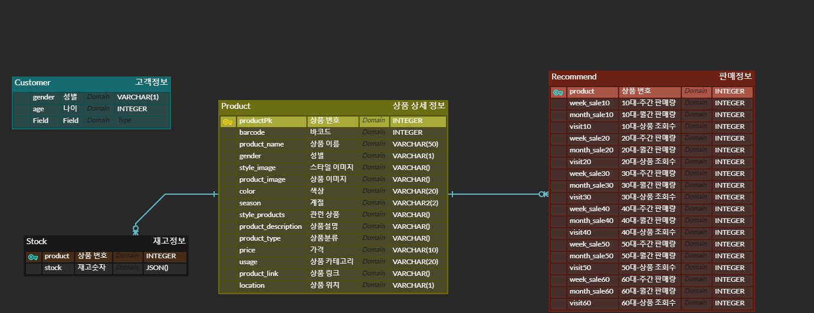

# django 사용법

가상환경 설정방법 

```bash
가상환경을 만든다
python -m venv venv

가상환경을 실행시킨다
source venv/Scripts/activate
```


(venv) 가 뜨면 제대로 가상환경이 셋팅된것.

필요한 패키지 import

```bash
장고는 필요한 패키지들의 리스트들을 만들어둘수 있다.(requirements.txt)
거기서 쓰여져있는대로 패키지들을 import한다
pip install -r requirements.txt

현재 설치된 패키지들을 확인한다.
pip freeze
```


가상환경과 Django환경이 동일함을 알수있다.

DB 설정

```bash
미리 설정해둔 장고 설정에따라 설계서를만든다.
python manage.py makemigrations

설계서대로 모델을 설정
python manage.py migrate

모델(빈꽉) 에 더미데이터를채워넣는다
python manage.py loaddata dummydata.json
```

장고 서버 실행

```bash
python manage.py runserver
```


## ERD 구조




## Backend

* django 사용하여 구성
* Front에서 axios 요청보내오면 요청 받은 데이터를 보내주고 필요에 따라 값을 변화시킨다. 


### model 설명 

* Product
  * 상품 ID, 바코드, 상품 이미지, 관련 상품 ID 등의 정보를 담는 모델이다.
* Recommend
  * Product 모델의 외래키로 연결되어 있으며 나이별 상품 판매량 조회수 등의 정보를 담는 모델이다.
* Customer
  * 사용자의 성별과 나이를 담는 모델이다.
* Stock
  * Product 모델의 외래키로 연결되어 있으며 해당 상품의 재고정보를 담는 모델이다.


### views.py 함수 설명

* products : 전체 상품 조회
* product_detail : product_id를 통해 특정 상품 조회
* product_stock: product_id를 통해 특정 상품 재고 조회
* kakaoPay_ready: 카카오페이 결제 준비
* make_status: 바코드 인식 기능 사용할 때 파일 생성해주는 기능
* kakaoPay_approve: 카카오페이 결제 승인 요청 (요청 후 정상 작동되면 재고내용 변동)
* recommended: 나이, 성별을 이용한 상품 추천 알고리즘
* product_list_create: 관리자가 상품을 생성하고 목록을 확인하는 기능
* product_update_delete: 관리자가 상품을 수정하고 삭제하는 기능
* signup: 관리자 등록


## 문제해결

* CORS 도메인 문제 해결 (django에서 보내주는 정보 vue에서 오류 없이 읽기)

[https://velog.io/@gomdori5505/CORS-도메인-문제-해결](https://velog.io/@gomdori5505/CORS-%EB%8F%84%EB%A9%94%EC%9D%B8-%EB%AC%B8%EC%A0%9C-%ED%95%B4%EA%B2%B0)

[https://oen-blog.tistory.com/46]


* SQLite does not support JSONFields 해결하기

> https://www.sqlite.org/download.html
>
> 위 페이지로 접속하여 본인 환경에 맞는 파일 다운로드
>
> https://code.djangoproject.com/wiki/JSON1Extension
>
> 다운로드 받은 파일 위 페이지 참고하여 본인 환경에 맞는 경로로 넣어주기


