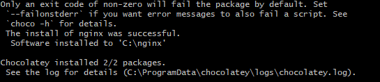
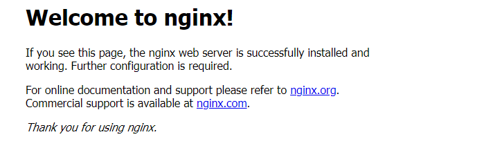

# BJ 정리


### 프로젝트 환경 구축


#### 윈도우 기반 패키지 관리 프로그램 chocolatey 설치 (linux apt와 유사)

- 이외의 설치 방법은 공식 페이지 참조
- https://chocolatey.org/install

```bash
# cmd 기준 + 관리자 권한으로 실행
@"%SystemRoot%\System32\WindowsPowerShell\v1.0\powershell.exe" -NoProfile -InputFormat None -ExecutionPolicy Bypass -Command "iex ((New-Object System.Net.WebClient).DownloadString('https://chocolatey.org/install.ps1'))" && SET "PATH=%PATH%;%ALLUSERSPROFILE%\chocolatey\bin"

$ choco -v
```


#### node.js 설치

- 윈도우는 인스톨로도 설치가능하지만 chocolatey를 통해 관리해보고자 함

```bash
# cmd, bash, powershell 아무거나 상관 없음
$ choco install nodejs
# 재실행 후
$ node -v
$ npm -v
```


#### vscode 설치

- 인스톨, chocolatey 모두 가능

```bash
$ choco install vscode
```

- 설치 후 ESLint, ES7 React snippet, Prettier - Code formatter, Rainbow Brackets 확장 프로그램 설치
- 설정(ctrl+,)을 열고 format on save 체크, compact folders 체크 해제


#### nginx 설치

- choco로 설치해보기

```bash
$ choco install nginx --params '"/installLocation:C:\nginx /port:8080"'
```

- choco 아니라도 윈도우는 공식 홈페이지에서 설치 가능
- 설치 완료 메시지



- https://localhost:8080 결과




